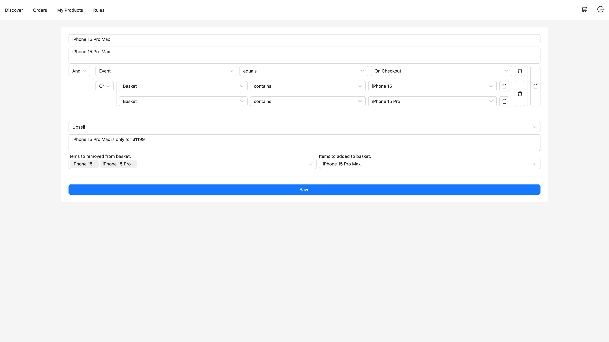
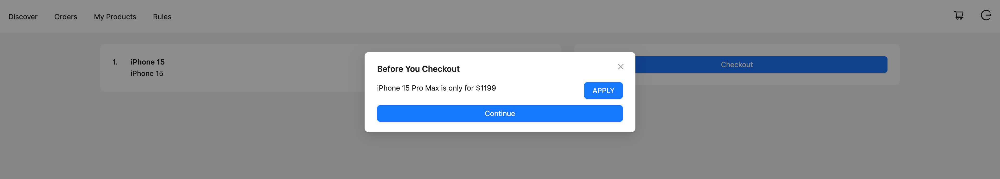

# Running the Demo
You can use docker commands to build and run the application.
```
docker build -t upsell_demo .
docker run -p 3000:3000 -env SECRET_KEY_BASE=xxx upsell_demo
```

# Documentation
The following sections will explain each functionality implmented in the demo.

## Login & Register

Pretty straight forward. Sellers and Customers can register and login.

## Discover / Products

Lists all the products which marked as listed from all sellers.

## My Products

Users can view, add, edit or mark as unlisted their own products.

## Rules / Upsell



Sellers can define rules to promote to their higher-tier product. They could define business rule and action in this page.

As an example, if customer is buying iPhone 15 or iPhone 15 Pro, the merchant can define a rule to encourage them towards iPhone 15 Pro Max. They can create more complex rules if needed by chaining conditions using and/or statements.

## Shopping Basket

Users can add the products in their basket the product they want to purchase.

## Checkout / Order

When the user clicks on Checkout button on their basket, they are prompted with the options to upgrade their products based on the merchant's upsell rules. If the user chooses to upgrade, the system will automatically replace the products in the basket with the product defined in the rule.



Users can proceed to complete their orders by entering their payment information.